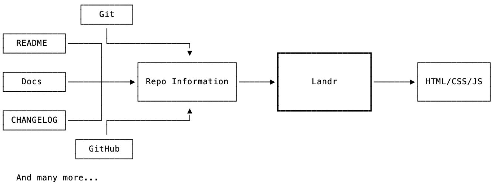

How does Landr works?
=====================

The main goal of Landr is to generate useful and decent websites to describe a
software project with the least possible amount of configuration. Landr is
supposed to be opitionated by design and rely on common open source conventions
rather than on user input.

Think about the core of Landr as a function that takes a machine-readable
snapshot of the current state of a project repository and outputs a static
site.

The repository information is made of a mixture of metadata coming from GitHub,
such as the issue tracker and releases, from the git history, such as
contributors and tags, and from files in the project, such as the README and
the CHANGELOG.

Landr is supposed to generate a static website by only consuming information
from the repository snapshot. A violation of this design would be the website
making AJAX requests to the GitHub API at runtime.

Repository Snapshot
-------------------

Note that Landr takes an input JSON object describing the state of a
repository, but it not able to generate it by itself. Balena maintains a
standalone project that performs this step called
[Scrutinizer](https://github.com/balena-io-modules/scrutinizer), and Landr is
meant to remain decoupled from it and rely on the interface instead.

Adaptative Website Generation
-----------------------------

The amount of information we can obtain from a repository differs on the
project and on how standard the conventions that the project is adopting are,
so most of the things that the repository snapshot might contain are optional.

The Landr website generation step should attempt to produce a useful and
good-looking website, no matter what subset of the properties of the project
snapshot we can count on.

Deployment
----------

Once the static website files are generated, Landr will deploy these files to
[Netlify](https://www.netlify.com), which is pretty much GitHub Pages on
steroids, creating a Netlify site on the account if necessary.

We actively want to **not** connect a GitHub repository with Netlify
automatically such that any change to the repo will trigger a Netlify update,
as Landr should not dictate what the workflow of building and deploying the
product is, and remain flexible if needed.
