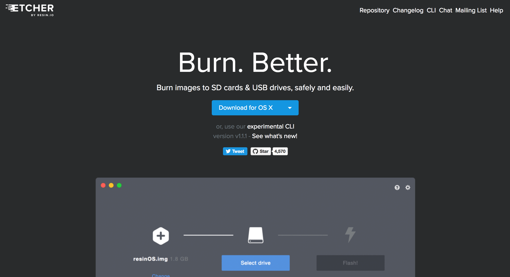
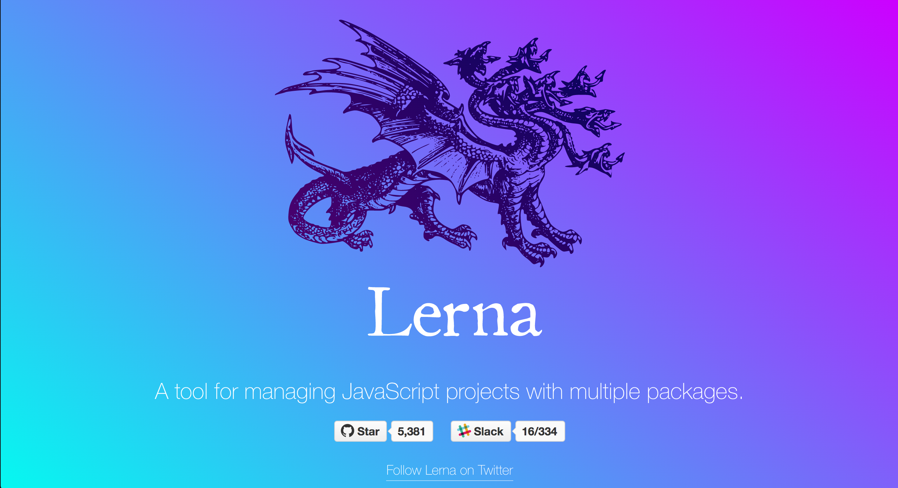

# landr

source code = website!

> Build a website for your software projects with one command (and zero configuration).

## How it works

When you run landr on your local repository, it gathers info by leveraging standard conventions.
It'll first look for a git remote from `github.com` and retrieve some basic information about your project from the github api (`contribution stats`, `releases`), it will then parse standard files like `README.md`, `CHANGELOG.md`, `CONTRIBUTING.md` & `/docs`, it'll then use the data to build out beautiful pages for your website.

This allows the maintenance of your website to be a side effect of keeping your software project inline with standard github conventions.

## Quick start guide

Install:
```
npm i -g landr@canary
```

From the root of your local `.git` repo run:
```
landr develop
```
Visit `http://localhost:8080`.

Deploy to github pages:
```
landr deploy
```

## Site composition

We'll currently build these pages based on the info we can infer from a repo.

- /
  - Jumbotron (title + description of project)
  - Installation / Getting started
    - instructions pulled from `README.md`
  - Features
    - list of features
  - Changelog (Last entry, with link to view more)
    - link to `/changelog`
  - Contribute
    - (Top 5 contributors / order by commits )
    - Issue explorer (default tag is `help wanted`)
    - link to `/contribute`
- /docs
  - generates a page for each /docs/* page.
  - Sidebar navigation
- /changelog
  - accordion list view of every entry from `changelog.md` or fallback to pulling from github releases
- /contribute
  - list of contributors
  - stats from github api (health score/languages etc.)
  - instructions from `CONTRIBUTING.md`

## Customizing

It's great to get a full website with out touching any css/html, but you may want personalize the website by editing templates and styles, landr comes with an `eject` command to customize any piece of the website.

### Styles
```
landr eject --styles
```

This will write a file to `<project-root>/www/styles/index.scss` where you can customize theme variables and add any custom sass.

### Components

All of landr's templates are made from react components, which makes them modular and easy to customize.

```
landr eject --component jumbotron
```

Will write a file `<project-root>/www/components/jumbotron.js` you can make any customizations you like.

The component is a standard [react.js](https://facebook.github.io/react/) but you can also export a [graphql query fragment](http://graphql.org/learn/queries/#fragments) to customize the data we as react `props`.

Heres an example:

```
import React from 'react';
import { Banner, Heading, Text, Lead } from 'rebass';

export default ({ repo }) => {
  return (
    <Banner
    	color='white'
    	bg='gray9'
      >
    	<Heading
    		f={[ 4, 5, 6, 7 ]}>
    		{repo.name}
    	</Heading>
      <Lead>
      	{repo.description}
      </Lead>
    </Banner>
  );
};

export graphql`
  fragment HeroRepoFragment on Repo {
    name
    description
  }
`
```

### Pages

Most times you'll only need to update components but if you need you can customise an entire page.

```
landr eject --page index
```

### Layouts

Sometime's you'll want to change the layout of all the pages. Landr current has to `index` (default for all pages) and `docs` the default for an `/docs` page.

```
landr eject --layout index
```

### Configuration

I know, we said there is zero configuration, but there are some cases where configuration is necessary for example if you need to add analytics tokens, or ignore certain files.

landr allows configuration via a `landr.conf.js` file in `<project-root>/www/` it must export a config object.

```js
// www/landr.conf.js
module.exports = {
  analytics: {
    mixpanel: <mixpanel-id>
    googleAnalytics: <ga-id>
  }
}
```

## Why landr

You have to maintain your source code why maintain a website too?

As a software company we have a growing number of websites to build and maintain. We built landr so we could focus on our projects and not their websites.

Most OS websites the same, the have a hero, a getting started and some docs. There is definitely room for automation.





## Contributing

```
npm i
```

```
cd packages/landr && npm link
```

Get to work. 👷

## License

Landr is free software, and may be redistributed under the terms specified in the [license](LICENSE).
