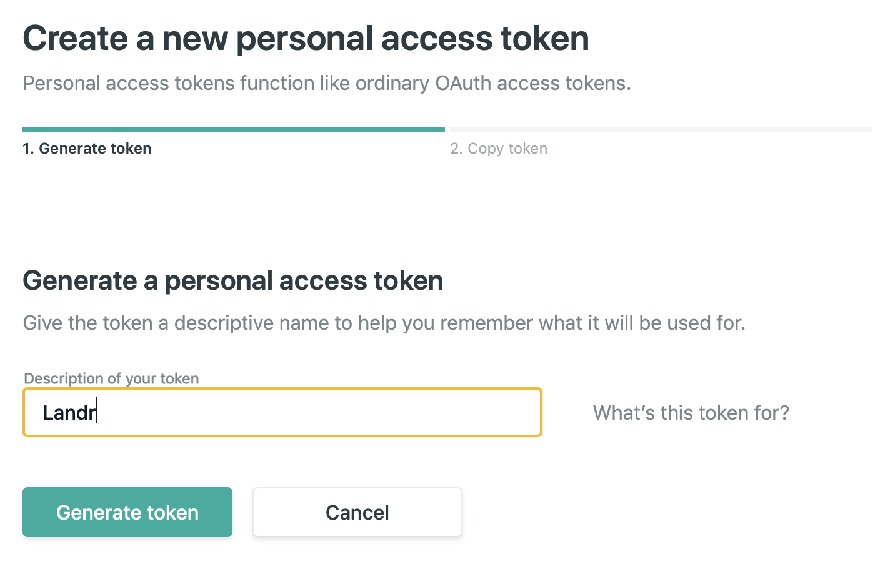

# Running in CI

The Landr project makes use of [Netlify](https://www.netlify.com) to deploy the
generated website. For this reason, you will need to generate a Netlify
_Personal Access Token_ and set it as an environment variable called
`NETLIFY_AUTH_TOKEN`.

## Generating a Netlify Access Token

Login to your Netlify account and head over to the [`Application` tab in the
`User Settings` page](https://app.netlify.com/user/applications). Once there,
click on the `New Access Token` button:

Once there, put a descriptive name for your personal access token, such as
"Landr", and click `Generate token`:

Copy the token, and set it as the value for the `NETLIFY_AUTH_TOKEN` using the
Environment Variables section of your preferred CI service:

Click `Done!` and you are all set! Landr will automatically use the token you
set when it comes to deploying your static assets!
