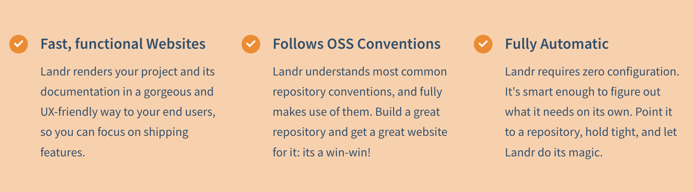
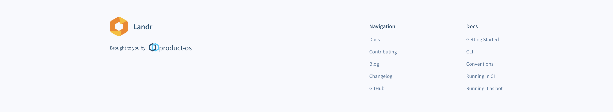
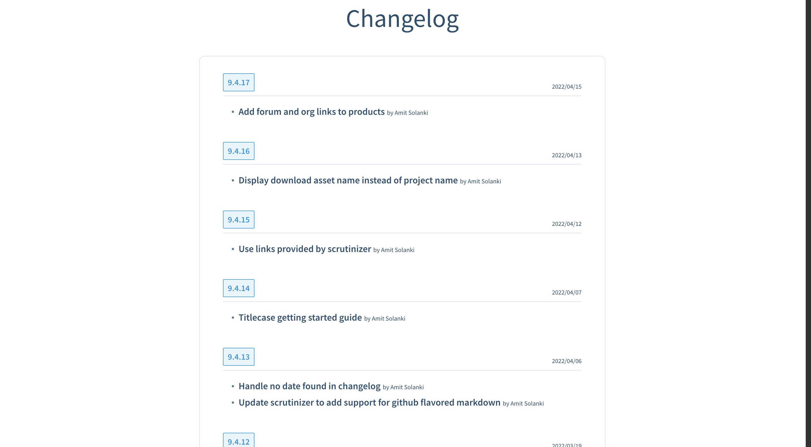
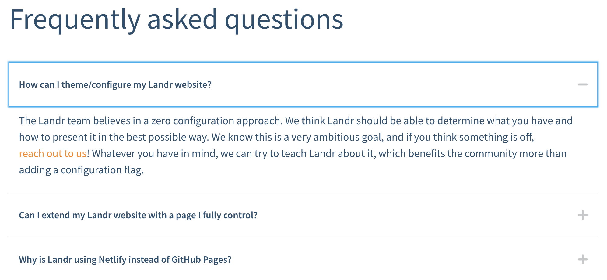
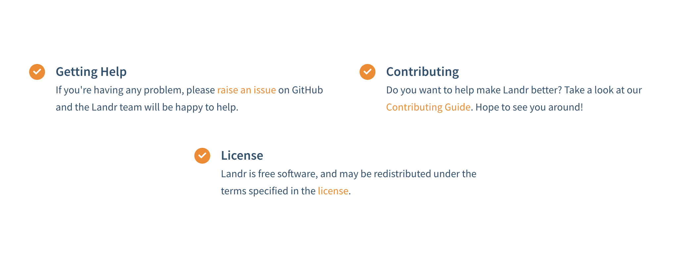
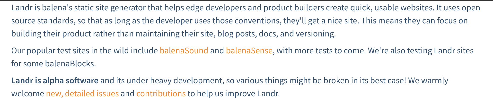
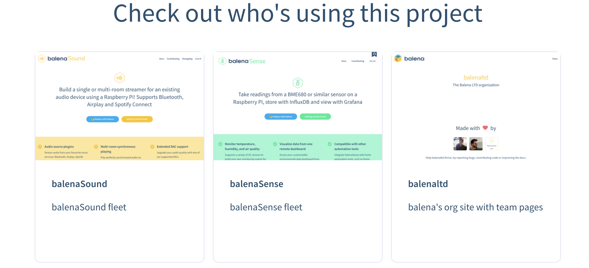

# Landr components and content types

Every page in landr is composed of a number of components. Based on the types of content of that page, each component decides how some sub set of that content should be rendered. For example, a list of Faqs will be rendered on the homepage just above the footer. Below is the list of all the components and their corresponding types of content as well as where that content is expected to be.

**Note:** _Some types of content are generic and is usually used across the site. For example, the logo. You can find these listed after the components below._

## Components

### Highlights

Highlights are used to emphasize a list of important product details, these could be product features, benefits, differentiating metrics, etc.

####  Sourced from

- Highlights are sourced from `README.md` file in the project root.
- It should be under a second level heading named `Highlights`.
- It is expected to be a list.
- Each highlight list item should have a title in the form of `**Title**` and description should follow the title.

#### Example

File: `README.md`
```markdown
## Highlights

- **Title**: Description
- **Important feature**: feature details
- **Notable benefit**: benefit details
```

#### Output



### Hardware Required

Highlights are used to emphasize a list of important product details, these could be product features, benefits, differentiating metrics, etc.

####  Sourced from

- Highlights are sourced from `README.md` file in the project root.
- It should be under a second level heading named `Highlights`.
- It is expected to be a list.
- Each highlight list item should have a title in the form of `**Title**` and description should follow the title.

#### Example

File: `README.md`
```markdown
## Highlights

- **Title**: Description
- **Important feature**: feature details
- **Notable benefit**: benefit details
```

#### Output


### Introduction

need to write

### Footer

Footer is present across all the pages. It displays navigation links, docs links and parent github org info.

#### Sourced from

- Navigation links generated by landr itself.
- Github org is sourced via github api.
- Org Logo is sourced from the github orgs profile.
- Product logo is sourced from the logo present in the README.md file.
- Doc links are various pages within the docs folder.

#### Output



### Hardware Required

### Contributors

Contributors are the people who have contributed to the project. They are listed above the footer. Only the top 10 contributors are displayed, which are sorted by number of commits.

#### Sourced from

- Contributors are sourced from the github api.
- We filter out the bots

#### Output


### ChangeLog

Changelog is rendered on `/changelog` page. It displays the version, change, date and author of that change.

#### Sourced from

- Changelog is sourced from `.versionbot/CHANGELOG.yml` or `Changelog.md` file in the project root.
- `.versionbot/CHANGELOG.yml` is the default and preferred way of fetching changelog, as it provides structured data.
- `Changelog.md` is the fallback and is rendered as markdown.

#### Output



### Motivation

### Jumbotron

Jumbotron is the section just above the fold and displays the important product info, like the title, brand logo, product description, installation instructions, screenshots, link to docs etc.

#### Sourced from

- `title` is sourced from github repos title.
- `description` is sourced from github repos description, if not present project name is used instead.
- Small logo is sourced from `logo.png` file in the project root.
- Installation instructions are sourced from `README.md` file in the project root.
  - It should be under a second level heading named `Installation`.
  - It is expected to be an ordered list.
- Screenshots are sourced from `screenshot.png` | `screenshot.gif` file in the project root.
- The getting started guide links to the docs page. If there are no docs, it is not linked.

#### Example

File: `README.md`
```markdown

## Installation

1. Install the Landr CLI:
   \`\`\`bash
   npm install --global landr
   \`\`\`
2. Go to a Balena CI powered repo:
   \`\`\`bash
   cd path/to/repository
   \`\`\`
3. Generate your website:
   \`\`\`bash
   landr
   \`\`\`
```


#### Output


### Faq

Frequently asked questions are listed on the homepage, just above the footer. They are shown as an accordion in the same order as they appear in the `FAQ.md` file.

#### Sourced from

- FAQ is sourced from `FAQ.md` file in the project root.
- Every question should be under a second level heading.
- Paragraphs under the question should contain the answer.

#### Example

File `FAQ.md`
```markdown
## Question 1
Answer to the question 1

## Question 2
Answer to the question 2
```

#### Output



### Blog List

Blog list is a list of all the blog post on the site. It is rendered on `/blog` page.

#### Sourced from

- Each markdown file under the `/blog` folder is considered a blog post.
- The title of the blog post is the URL of the blog post.
  - The title can be the level one Heading in the markdown file.
  - If not present, and there is a title field in the front matter, it is used.
  - If nothing is available, the title is the filename.
- The date of the blog post is sourced from the filename.
  - The date is expected to be in the format `YYYY-MM-DD`.
  - It should be the first part of the filename.
  - If not present, the date is the date of the last commit.
- Images inside the markdown should be relative to the markdown file, especially if the repo is private.

#### Example

- `blog/2020-01-21-blog-post-title.md`
- `blog/2020-01-22-blog-post-title-2.md`

#### Output


### Setup and Configuration


### Software Required

### Readme Sections

These are all the level two headings in the README.md file. These can include license, small sections linking to docs, etc.

#### Sourced from
- README.md file in the project root.
- It should be under a second level heading.
- Content should ideally be a few sentences or less.
- The content is rendered as markdown.

#### Example
File `README.md`
```markdown

## License

This project is licensed under the MIT license.

## Docs

To read more about this project, please visit our docs at https://docs.balena.io/

## Getting Help

If you're having any problem, please [raise an
issue](https://github.com/balena-io/landr/issues/new) on GitHub and the Landr
team will be happy to help.
```

#### Output



### Readme Leftover

This is the content of the README.md file that is not covered by any sections which landr understands.

#### Sourced from
- README.md file in the project root.
- These are rendered as-is and not structured, so please see the output and make sure it makes sense.
- The content is rendered as markdown.

#### Output

This is an example output of the leftover parts of readme, it might differ for your usage.


### Team

### Users

Users are all the end-users of your project, this can be used to link to their websites.

#### Sourced from
- Users are sourced from the `README.md` file in the project root.
- The content is expected to be a list of links.
- It should be under a second level heading, with title "Examples".
- The link should follow the project name.

#### Example

File `README.md`
```markdown

## Examples

- [balenaSound](https://sound.balenalabs.io/) - balenaSound fleet
- [balenaSense](https://sense.balenalabs.io/) - balenaSense fleet
- [balenaltd](https://balenaltd.com/) - balena's org site with team pages

```

#### Output



### User Info

### Legal Docs

### Docs Viewer

### Downloads

